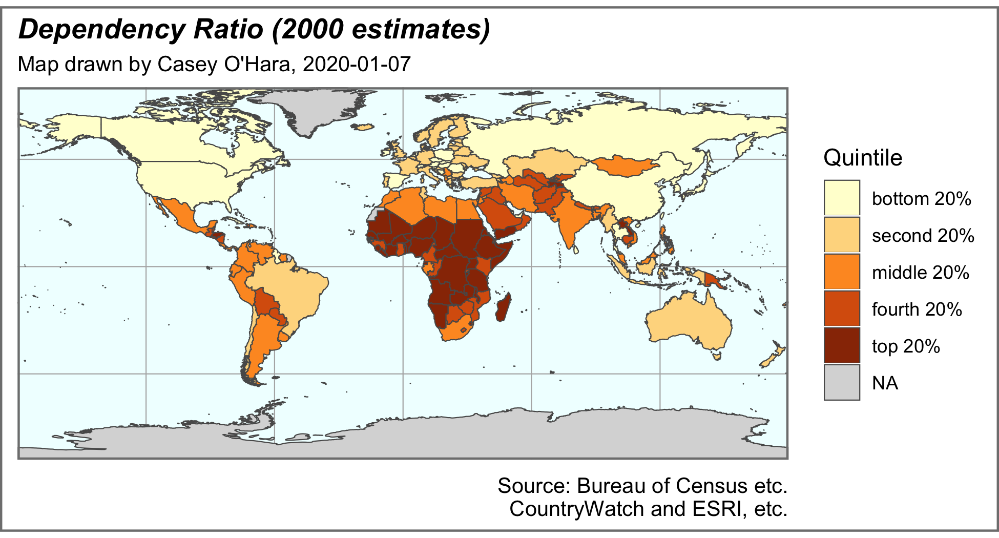

```{r setup, include=FALSE}
knitr::opts_chunk$set(echo = TRUE)
library(tidyverse)
library(sf)
```

# Overview

For creating a pretty map layout, R may be somewhat limited compared to ArcMap, especially since ArcMap has a graphical interface designed specifically for making nice layouts.  When we get to spatial analysis, we can do mamy things in R that we will learn how to do in ArcMap.

Some notes: The `sf` package is a powerful and relatively new R package that works with vector spatial data (polygons, lines, points - as opposed to rasters).  It is designed to work well within the `tidyverse` functions and workflow.  An older system of spatial analysis was built around a package called `sp`, and its cousins `rgdal` and `rgeos`, which implement a couple of general spatial analysis libraries: [GDAL, or Geospatial Data Abstraction Library](https://gdal.org/faq.html) and [GEOS, or Geometry Engine - Open Source](https://trac.osgeo.org/geos/). The `sf` package relies on the same libraries but is much less annoying than the older `sp` package.

# Load the spatial data

The .gdb file extension indicates a geodatabase, usually with multiple layers and attributes.  If these come from ArcMap, they may have some proprietary features that makes them more difficult to work with.  Another commonly used format is the shapefile (.shp, which is always accompanied by a few related files, including a projection, `.prj`, and an attribute table, `.dbf`).

For this assignment, the `HW1.gdb` file is a geodatabase containing just a grid of the world cut into 30° squares.  The `CountryWatch.lyr` combines a world map with country attributes and even some formatting.  But it's a pain to work with outside of ArcMap.  Instead, I used ArcMap to load the `CountryWatch.lyr` and saved it back out as a shapefile (.shp with the spatial information as a polygon feature for each country) with its attribute table (.dbf with all CountryWatch data tied to each feature in the shapefiles).

In the `sf` package, most functions start with `st_` (for "spatiotemporal"), including `st_read` and `st_write`, but there's also `read_sf` and `write_sf` which are basically the same with a few simplifying assumptions.  Point the `read` functions toward the shapefile `.shp`, and it will automatically pull in the `.dbf` and `.prj` and whatnot.

```{r}
country_data_sf <- st_read('shapefiles/Countries.shp') %>%
  janitor::clean_names()
grid_sf <- read_sf('shapefiles/World30.shp') %>%
  janitor::clean_names()

names(country_data_sf)
```

## viewing data from an `sf` object

A simple features object is essentially a dataframe with a row for each feature (e.g. country) and columns for all the variables, and one extra column, a `geometry` column, that holds all the spatial info for that feature.  Using `View()` on an `sf` object bogs things down since it tries to show that geometry column.  

You can separate the data from the geometry to make the data part a little easier to work with, though.  Note I sometimes use a tag at the end of the object name so I can easily see what type: `_sf` for simple features, `_df` for dataframes, `_rast` for rasters, etc.  Not necessary but I find it helpful.  The `geometry` column is "sticky" in an `sf` object, so `select` can't drop it - so instead we coerce the object to a data frame, _then_ select out the geometry...

```{r}
country_data_df <- country_data_sf %>%
  as.data.frame() %>%
  select(-geometry)
```

## making a very simple map

The `ggplot2` package works well with simple features, using the `geom_sf()` layer.  You can put the simple features data into the initial `ggplot` call, but because it's an odd data type, and we're often using multiple `sf` layers, it can simplify things to just call it and set the aesthetics in the `geom_sf(data = ...)` call.

We need to fix the NA values first though.  I'm mapping the Dependency Ratio so I'll just select that column (since `geometry` is "sticky", so I don't need to worry about it in my `select` call here - it will stay with the object).

```{r}
depratio_sf <- country_data_sf %>%
  select(depratio = depratio00) %>%
  mutate(depratio = ifelse(depratio < 0, NA, depratio))

ggplot() +
  geom_sf(data = depratio_sf, aes(fill = depratio)) +
  scale_fill_distiller(palette = 'YlOrBr', 
    ### see RColorBrewer::display.brewer.all() for different palettes
                       direction = 1,
                       limits = c(0, NA)) 
    ### sets bottom limit to 0, top limit to infinity, forcing the 
    ### palette to go all the way to zero
```

Note that we don't even need the grid from the World30 shapefile, `ggplot` adds graticules for us.

# Making it fancy

With a basic map, we can start to use `theme` and other plot options to make it look a little nicer.  In the assignment, I used a discrete scale for colors, based on certain cut points (60%, 75%, 90%, 100%, more than 100%).  Here let's try dividing into quantiles - I like quintiles, so the bottom 20%, second 20%, etc.  Now we're mapping a discrete variable (quantiles) instead of a continuous (dependency ratio), so we'll use `scale_fill_brewer()` which works for discrete.

Note on the mutate stuff: first calc which quintile each country falls in, then give it a text description.  Since we arranged by dependency ratio, we know the quintiles are in order, so `fct_inorder` forces the text descriptions to be factors in the correct order.

```{r}
dep_quintiles_sf <- depratio_sf %>%
  arrange(depratio) %>% 
  mutate(dep_qtile = ntile(depratio, 5),
         qtile_desc = case_when(dep_qtile == 1 ~ 'bottom 20%',
                                dep_qtile == 2 ~ 'second 20%',
                                dep_qtile == 3 ~ 'middle 20%',
                                dep_qtile == 4 ~ 'fourth 20%',
                                dep_qtile == 5 ~ 'top 20%',
                                TRUE ~ NA_character_), ### for NAs
         qtile_desc = fct_inorder(qtile_desc))

### to check what the data looks like now
# dep_qtiles_df <- dep_quintiles_sf %>%
#   as.data.frame() %>%
#   select(-geometry)

ggplot() +
  geom_sf(data = dep_quintiles_sf, aes(fill = qtile_desc)) +
  scale_fill_brewer(palette = 'YlOrBr', 
                    direction = 1,
                    na.value = 'grey50') 

```

Now let's change the background to blue, trim the map edges in, add a title, subtitle, and caption.  We'll also drop the degree markers around the edges. We'll add a heavier border to the map (`panel.border`) and the whole image (`plot.background`). The `theme` ggplot layer can change the format of pretty much any element you want to change.

We'll store this plot in an object, so it doesn't immediately print to the screen; instead we'll `ggsave` it and then include the saved plot instead.

```{r}
map_date <- Sys.Date()

nicer_plot <- ggplot() +
  geom_sf(data = dep_quintiles_sf, aes(fill = qtile_desc),
          size = .25) +
  scale_fill_brewer(palette = 'YlOrBr', 
                    direction = 1,
                    na.value = 'grey85') +
  theme(plot.title = element_text(face = 'bold.italic'),
        plot.subtitle = element_text(size = 8),
        plot.caption = element_text(size = 8),
        panel.background = element_rect(fill = 'azure1'),
        panel.border = element_rect(color = 'grey50', fill = NA, size = 1),
        panel.grid   = element_line(color = 'grey70', size = .25),
        axis.text = element_blank(),
        axis.ticks = element_blank(),
        plot.background = element_rect(color = 'grey50', fill = NA, size = 1)) +
  coord_sf(expand = FALSE) +
  labs(fill =  'Quintile',
       title = 'Dependency Ratio (2000 estimates)',
       subtitle = paste0("Map drawn by Casey O'Hara, ", map_date),
       caption = paste("Source: Bureau of Census etc.",
                       "CountryWatch and ESRI, etc.",
                       sep = '\n')) ### use \n to get multiple lines

ggsave('basic_plot.png', dpi = 300, width = 6.5, height = 3.5)
```




