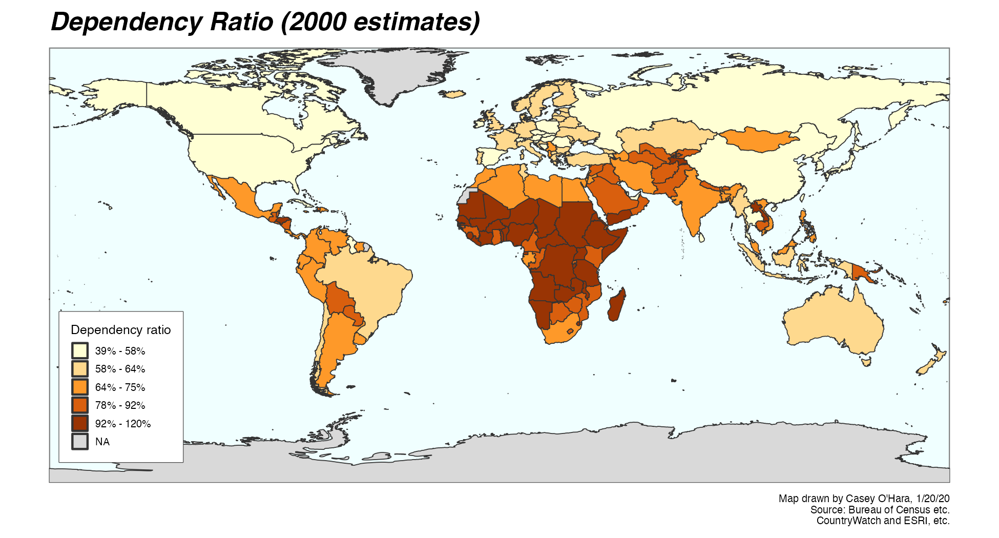

```{r setup, echo = TRUE, message = FALSE, warning = FALSE}
knitr::opts_chunk$set(echo = TRUE, message = FALSE, warning = FALSE)
library(tidyverse)
library(here)
library(sf)
library(cowplot)
```

# Overview

The focus of this $\textsf R$ Markdown script is to show basic map-making capabilities in $\textsf R$, based on Assignment 1 from Frew's ESM 263 class (Winter 2020).  We'll use the `sf` package and `tidyverse` to:

* read in a shapefile containing countries of the world and the CountryWatch data
* make simple calculations of the CountryWatch data to "bin" data into quintiles
* use `ggplot2::ggplot()` and `ggplot2::geom_sf()` to create visualizations (maps) and play around with parameters to make the maps look nice
* use `cowplot::plot_grid()` and some other functions from the `cowplot` package to make more complex maps using multiple elements such as legends and inset maps.

## Vector spatial data in $\textsf R$

For creating a pretty map layout, $\textsf R$ may be somewhat limited compared to ArcMap or QGIS, especially since these standalone GIS software applications use a graphical interface designed specifically for making nice layouts.  When we get to spatial analysis, we can do many things in $\textsf R$ that we will learn how to do in standalone GIS.

Some notes: The `sf` package is a powerful and relatively new $\textsf R$ package that works with vector spatial data (polygons, lines, points - as opposed to rasters).  It is designed to work well within the `tidyverse` functions and workflow.  An older system of spatial analysis was built around a package called `sp`, and its cousins `rgdal` and `rgeos`, which implement a couple of general spatial analysis libraries: [GDAL, or Geospatial Data Abstraction Library](https://gdal.org/faq.html) and [GEOS, or Geometry Engine - Open Source](https://trac.osgeo.org/geos/). The `sf` package relies on the same libraries but is much less annoying than the older `sp` package.

# Load the spatial data

The .gdb file extension indicates a geodatabase, usually with multiple layers and attributes.  If these come from ArcMap, they may have some proprietary features that makes them more difficult to work with.  Another commonly used format is the shapefile (.shp, which is always accompanied by a few related files, including a projection, `.prj`, and an attribute table, `.dbf`).

For this assignment, the `HW1.gdb` file is a geodatabase containing just a grid of the world cut into 30° squares.  The `CountryWatch.lyr` combines a world map with country attributes and even some formatting.  But it's a pain to work with outside of ArcMap.  Instead, I used ArcMap to load the `CountryWatch.lyr` and saved it back out as a shapefile (.shp with the spatial information as a polygon feature for each country) with its attribute table (.dbf with all CountryWatch data tied to each feature in the shapefiles).

In the `sf` package, most functions start with `st_` (for "spatiotemporal"), including `st_read` and `st_write`, but there's also `read_sf` and `write_sf` which are basically the same with a few simplifying assumptions.  Point the `read` functions toward the shapefile `.shp`, and it will automatically pull in the `.dbf` and `.prj` and whatnot.

```{r}
country_data_sf <- st_read(here('HW1', 'shapefiles/Countries.shp')) %>%
  janitor::clean_names()
grid_sf <- read_sf(here('HW1', 'shapefiles/World30.shp')) %>%
  janitor::clean_names()

# names(country_data_sf)
```

## viewing data from an `sf` object

A simple features object is essentially a dataframe with a row for each feature (e.g. country) and columns for all the variables, and one extra column, a `geometry` column, that holds all the spatial info for that feature.  Using `View()` on an `sf` object bogs things down since it tries to show that geometry column.  

You can separate the data from the geometry to make the data part a little easier to work with, though.  Note I sometimes use a tag at the end of the object name so I can easily see what type: `_sf` for simple features, `_df` for dataframes, `_rast` for rasters, etc.  Not necessary but I find it helpful.  The `geometry` column is "sticky" in an `sf` object, so `select` can't drop it - so instead we coerce the object to a data frame, _then_ select out the geometry...

```{r}
country_data_df <- country_data_sf %>%
  as.data.frame() %>%
  select(-geometry)
```

## making a very simple map

The `ggplot2` package works well with simple features, using the `geom_sf()` layer.  You can put the simple features data into the initial `ggplot` call, but because it's an odd data type, and we're often using multiple `sf` layers, it can simplify things to just call it and set the aesthetics in the `geom_sf(data = ...)` call.

We need to fix the NA values first though.  I'm mapping the Dependency Ratio so I'll just select that column (since `geometry` is "sticky", so I don't need to worry about it in my `select` call here - it will stay with the object).

```{r}
depratio_sf <- country_data_sf %>%
  select(depratio = depratio00) %>%
  mutate(depratio = ifelse(depratio < 0, NA, depratio))

ggplot() +
  geom_sf(data = depratio_sf, aes(fill = depratio)) +
  scale_fill_distiller(palette = 'YlOrBr', 
    ### see RColorBrewer::display.brewer.all() for different palettes
                       direction = 1,
                       limits = c(0, NA)) 
    ### sets bottom limit to 0, top limit to infinity, forcing the 
    ### palette to go all the way to zero even if no countries have
    ### a zero value
```

Note that we don't even need the grid from the World30 shapefile, `ggplot` adds graticules for us (default, white lines on light grey background).  Note also that the color scale is continuous - not broken into quintiles or anything.

# Making it fancy

With a basic map, we can start to use `theme` and other plot options to make it look a little nicer.  In the assignment, I used a discrete scale for colors, based on certain cut points (60%, 75%, 90%, 100%, more than 100%).  Here let's try dividing into quantiles - I like quintiles, so the bottom 20%, second 20%, etc.  Now we're mapping a discrete variable (quantiles) instead of a continuous (dependency ratio), so we'll use `scale_fill_brewer()` which works for discrete.

Note on the mutate stuff: first calculate which quintile each country falls in, then give it a text description.  We can group by quintile and pull the min/max for the text description.  Since we arranged by dependency ratio, we know the quintiles are in order, so `fct_inorder` forces the text descriptions to be factors in the correct order.

```{r}
dep_quintiles_sf <- depratio_sf %>%
  arrange(depratio) %>% 
  mutate(dep_qtile = ntile(depratio, 5)) %>%
  group_by(dep_qtile) %>%
  ### note: to escape a percent sign so it displays in sprintf, 
  ### use %% - totally not confusing
  mutate(qtile_desc = sprintf('%s%% - %s%%', round(min(depratio)), round(max(depratio))),
         qtile_desc = ifelse(is.na(depratio), NA, qtile_desc), ### for NAs
         qtile_desc = fct_inorder(qtile_desc))

### to check what the data looks like now
dep_qtiles_df <- dep_quintiles_sf %>%
  as.data.frame() %>%
  select(-geometry)

ggplot() +
  geom_sf(data = dep_quintiles_sf, aes(fill = qtile_desc)) +
  scale_fill_brewer(palette = 'YlOrBr', 
                    direction = 1,
                    na.value = 'grey50') 

```

Now let's change the background to blue, trim the map edges in, add a title, subtitle, and caption.  We'll also drop the degree markers around the edges. The `theme` ggplot layer can change the format of pretty much any element you want to change.

We'll store this plot in an object, so it doesn't immediately print to the screen; instead we'll `ggsave` it and then include the saved plot instead.

```{r}
nicer_plot <- ggplot() +
  geom_sf(data = dep_quintiles_sf, aes(fill = qtile_desc),
          color = 'grey20', size = .1) +
  scale_fill_brewer(palette = 'YlOrBr', 
                    direction = 1,
                    na.value = 'grey85') +
  theme(text = element_text(size = 6), ### default text
        plot.title = element_text(face = 'bold.italic', size = 12),
        axis.text = element_blank(),
        axis.ticks = element_blank(),
        legend.key.size = unit(3, 'mm'),
        legend.position = c(.08, .22),
        legend.box.background = element_rect(color = 'grey20', size = .25),
        panel.background = element_rect(fill = 'azure1', color = 'grey50')) +
  coord_sf(expand = FALSE, datum = NA) + ### datum = NA suppresses the graticules
  labs(fill =  'Dependency ratio',
       title = 'Dependency Ratio (2000 estimates)',
       caption = paste("Map drawn by Casey O'Hara, 1/20/20",
                       "Source: Bureau of Census etc.",
                       "CountryWatch and ESRI, etc.",
                       sep = '\n')) ### use \n to get multiple lines

ggsave(here('HW1/img/basic_plot.png'), dpi = 300, 
       width = 6.5, height = 3.5)
```




# Replicating the white-on-black map

One student created a striking negative-image map, white on black, and here's an approximation of that.

```{r}
coal_sf <- country_data_sf %>%
  select(coal_res = coal_res98) %>%
  mutate(coal_res = ifelse(coal_res < 0, NA, coal_res)) %>%
  arrange(coal_res) %>% 
  mutate(coal_cat = case_when(coal_res <= 5000   ~ '0-5B tons',
                              coal_res <= 25000  ~ '5B-25B tons',
                              coal_res <= 100000 ~ '25B-100B tons',
                              coal_res <= 200000 ~ '100B-200B tons',
                              coal_res > 200000  ~ '200B+ tons',
                              TRUE ~ 'No Data'),
         coal_cat = fct_inorder(coal_cat))
```

We'll use the `coal_cat` variable to drive `fill` (shades of grey with one more saturated for emphasis), `color` (all grey except emphasis), and `linetype` (solid for all but `NA`).  Then we can use `scale_X_manual()` to set scales for fill, color, and linetype separately.
``` {r}

coal_lvls <- levels(coal_sf$coal_cat)
# "0-5B tons"      "5B-25B tons"  "25B-100B tons"  
# "100B-200B tons" "200B+ tons"   "No Data"
coal_fills <- c('grey20', 'grey40', 'grey60', 'grey80', 'grey95', 'black')
coal_cols  <- c('grey50', 'grey50', 'grey50', 'grey50', '#ffff44', '#882222')

inverse_plot <- ggplot() +
  geom_sf(data = coal_sf, 
          aes(fill = coal_cat, color = coal_cat),
          size = .15) +
  scale_fill_manual(breaks = coal_lvls, values = coal_fills) +
  scale_color_manual(breaks = coal_lvls, values = coal_cols) +
  theme(text = element_text(size = 6, color = 'white', family = 'AvantGarde'), 
          ### default text; note AvantGarde might not work on some systems
        plot.title = element_text(face = 'bold', size = 12),
        plot.subtitle = element_text(face = 'bold', size = 9),
        panel.background = element_rect(fill = 'black'),
        panel.border = element_rect(color = 'grey30', fill = NA, size = 1),
        panel.grid   = element_line(color = 'grey30', size = .25),
        axis.text = element_blank(),
        axis.ticks = element_blank(),
        legend.key.size = unit(3, 'mm'),
        legend.key = element_rect(color = NA, fill = NA),
        legend.position = c(.08, .25),
        legend.background = element_rect(fill = NA),
        plot.background = element_rect(color = 'grey50', fill = 'black', size = 1)) +
  coord_sf(expand = FALSE) +
  labs(fill =  'Coal reserves', color = 'Coal reserves',
       title = 'NATIONAL COAL RESERVES 1998',
       caption = paste("Map drawn by Casey O'Hara, 1/20/20",
                       "Source: Bureau of Census etc.",
                       "CountryWatch and ESRI, etc.",
                       sep = '\n')) ### use \n to get multiple lines

ggsave(here('HW1/img/inverse_plot.png'), dpi = 300, width = 6.5, height = 3.5)

```

<!--You can use inline code to indicate relative pathnames-->
<!-- note, this is an HTML comment, starting with the arrow/exclamation point/two dashes and going till the two dashes/arrow -->
`)

# Multiple maps and insets with `cowplot`

The `cowplot` package allows you to combine multiple plots/maps/graphics objects (`grob`s) into one.  For example, a figure in a journal article might have parts A, B, and C; `cowplot` can do that.  Here we'll do something simple with it - first we'll just put both into a single figure, using the `cowplot::plot_grid()` function.  

Note that you might have to play with the saved image size to make it look good.  Because `geom_sf` locks the aspect ratio (height vs width) it might add a lot of white space to make it fit your saved plot size...

```{r}
multi_plot <- cowplot::plot_grid(nicer_plot, inverse_plot, 
                                 align = 'h', ncol = 1, labels = c('A', 'B'))

ggsave(here('HW1/img/multi_plot.png'), width = 6.5, height = 7)

knitr::include_graphics(here('HW1/img/multi_plot.png')) 
  ### a different way of including images in R Markdown
```

## Adding an inset

Now let's add one of our previous maps (`nicer_plot`) to the other one (`inverse_plot`) as an inset.  Here we'll use `cowplot::ggdraw()` which sort of sets up a combo plot canvas to which we can add plots, and `cowplot::draw_plot()` to add plots to it.  By default, `cowplot` thinks of the canvas as an x and y axis going from 0 (bottom left corner) to 1 (moving up or to the right), so we can position and size our plots using this. 

We'll deconstruct our maps to separate the map itself from the legend using `cowplot::get_panel` and `cowplot::get_legend` (note, this also drops the title etc).  The legend objects don't play all that well here, so there are some alignment issues, but you can get the idea.

```{r}

### Modifying the legend so it's black text on white background, and matches
### the legend for the dependency ratio plot...
inv_plot_new_legend <- inverse_plot + 
  theme(legend.background = element_rect(fill = 'white'),
        legend.box.background = element_rect(color = 'grey20', size = .25),
        text = element_text(color = 'black', family = 'sans'))

coal_map <- get_panel(inverse_plot)
coal_legend <- get_legend(inv_plot_new_legend)
depratio_map <- get_panel(nicer_plot)
depratio_legend <- get_legend(nicer_plot)

inset_plot <- ggdraw() +
  draw_plot(coal_map, 
            ### locate the bottom left corner at (0, .1):
            x = 0, y = .1,              
            ### make the plot 1 wide (full panel) and .9 tall (from 0.1 to 1):
            width = 1, height = .9) +   
  draw_plot(depratio_map,
            ### locate the bottom left at (0.04, 0.30):
            x = .04, y = .35,            
            ### shrink this map to be smaller.:
            width = .20, height = .20) + 
  draw_plot(depratio_legend,
            ### locate the bottom left at (.06, .05):
            x = .06, y = .10,            
            ### legend interacts weirdly with size and location so play around:
            width = .2, height = .3) +   
  draw_plot(coal_legend,
            ### locate the bottom left at (.76, .10):
            x = .76, y = .10,            
            width = .2, height = .3) 

ggsave(here('HW1', 'img', 'inset_plot.png'), width = 6.5, height = 4)

knitr::include_graphics(here('HW1', 'img', 'inset_plot.png')) 
```

## more complicated example

I'm not gonna put the code here for this one, but to give a sense of what you can do with `cowplot` and `ggplot`, here's a complex map graphic I assembled for a paper, [Changes in ocean health in British Columbia from 2001 to 2016](https://journals.plos.org/plosone/article?id=10.1371/journal.pone.0227502)

`r knitr::include_graphics('img/flower_plot_map_2016.png')`
