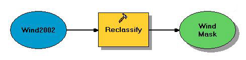
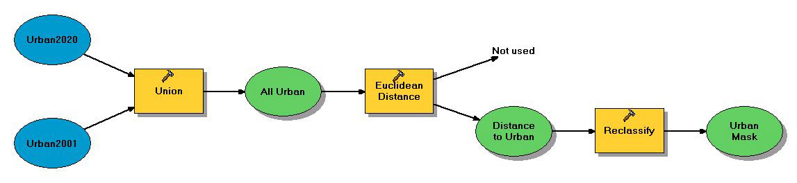
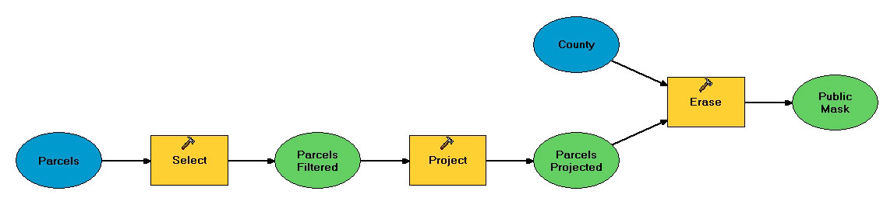
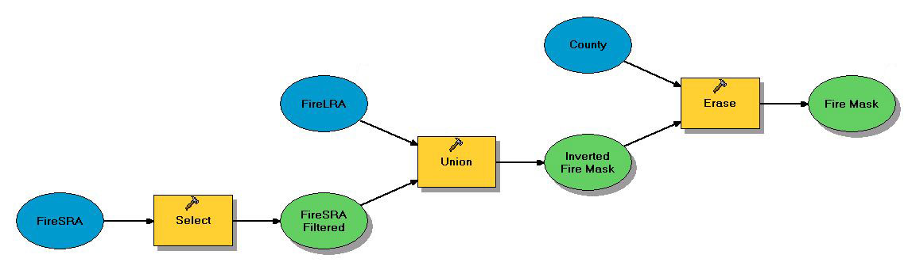
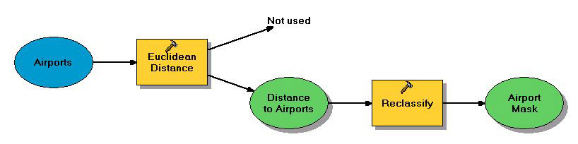

```{r setup, include=FALSE}
knitr::opts_chunk$set(echo = TRUE, message = FALSE, warning = FALSE)

### NOTE: loading the raster package BEFORE tidyverse... to avoid the
### raster::select() function from overriding the dplyr::select().
library(raster)
library(fasterize)
library(sf)
library(tidyverse)
library(mapview)

source('helper_fxns.R')
```

# Site suitability analysis for wind power subsidies {.tabset}

## Overview

Here we will use the data provided by Frew in `HW3.gdb` and a separately-exported raster `Wind2002.tif` (since rasters in geodatabases are not readily accessible except in ArcMap) to recreate the same basic analysis as we built in Model Builder for assignment 3.  The main steps:

* Create the masks:
  * Create a wind mask based on 200 m raster cells with class 3 or higher wind resources.
  * Create a road mask based on areas within 7.5 km of existing major roads.
  * Create an urban mask based on areas farther than 1 mile from urban areas.
  * Create a public mask based on areas that are not public parks etc.
  * Create a fire risk mask based on areas that are not classified as fire hazard areas.
  * Create an airport mask based on areas that are farther than 7.5 km from airports.
* Combine the masks to identify suitable areas.
* Identify contiguous suitable regions and rank the top ten based on area.

As in other assignments, there are a few ways to do some of these steps, so I'll show a few options where I can.  First, let's set up a couple of things, analogous to our environment settings.

```{r}
### Set up a base raster with the CRS, extent, and resolution for our
### analysis.  This is based on the wind raster.

base_rast <- raster::raster('data/Wind2002.tif')
base_rast

# st_layers('data/Basemap.gdb')
county_sf <- st_read('data/county.shp')
cities_sf <- read_sf(dsn = 'data/Basemap.gdb', layer = 'Cities')
roads_sf  <- read_sf(dsn = 'data/HW3.gdb', layer = 'CenterLines2008')

### also set the preferred CRS, CA Teale Albers NAD 1987 in meters.
### We can get this from either the base rast or the county sf objects.
ca_alb <- st_crs(county_sf)
```

Make a quick map!

```{r}
ggplot() +
  theme_minimal() +
  geom_sf(data = county_sf, fill = 'grey30') +
  geom_sf(data = roads_sf, color = 'darkred', size = .25) +
  geom_sf(data = cities_sf, fill = 'grey40', color = 'grey50') +
  geom_sf_text(data = cities_sf, aes(label = CITY), color = 'grey90', size = 3)
```

## Create the masks {.tabset}

Click on the tabs to see each model in turn.

### Create wind mask



Here we can simply use the `raster::reclassify()` function just as we did in ArcMap model builder.  We'll need to set up a matrix of original values and the new values.  There's also another way to do the same thing, shown after `reclassify()`.

```{r}
wind_raw_rast <- raster('data/Wind2002.tif')
plot(wind_raw_rast, main = 'Raw wind raster')

rcl_mtx <- matrix(data = c(c( 1,  2, 3, 4, 5, 6, 7),
                               c(NA, NA, 1, 1, 1, 1, 1)),
                      ncol = 2, byrow = FALSE)
rcl_mtx

wind_mask_rast <- raster::reclassify(wind_raw_rast, rcl = rcl_mtx)
plot(wind_mask_rast, main = 'Reclassified wind raster', legend = FALSE)

```

But we can also use vector indexing to directly replace the values too!

```{r}
### first make a copy of the wind_raw_rast so we can change it
wind_mask2 <- wind_raw_rast

### turn low wind values to NA:
values(wind_mask2)[values(wind_mask2) < 3] <- NA

### note, we haven't changed the other values to 1 yet; technically
### that's fine - a mask really only needs to have data cells and
### NA cells.  But let's change them anyway - here's a trick I like to
### use to quickly set all non-NAs (and non-zeros) to 1: simply 
### divide the raster by itself!
wind_mask2 <- wind_mask2 / wind_mask2
plot(wind_mask2, main = 'Wind mask alt method', legend = FALSE)

compareRaster(wind_mask_rast, wind_mask2, values = TRUE)
### all.equal()

writeRaster(wind_mask_rast, 'output/wind_mask.tif', overwrite = TRUE)

```

### Create road mask


Let's read in the roads layer, and create a mask from that (remembering we need to project it to a new CRS, using `sf::st_transform()`, and using our `ca_alb` CRS we borrowed from the County layer).  The `raster` package doesn't have a nice Euclidean Distance function, and the `distance` and `distanceToPoints` functions like an old-school spatial object (`sp` package), rather than an `sf` object.  So here we'll use a different method:

* use `st_transform()` to project the roads into CA Teale Albers.
* feed that into `st_buffer` and set a distance of 7,500 m.
* collapse all the results into a single feature (we don't care about the road details, just whether there is a road or not)
* Note, this is a little slow.  Let's check to see if we already have a mask, and if so, skip rerunning it.

(We could do this same method in ArcMap too, using different tools instead of Euclidean Distance and Reclassify).

```{r}
road_mask_file <- 'output/road_mask.shp'

### start with the "meat" then wrap in the if-else!
if(!file.exists(road_mask_file)) {
  # st_layers('data/HW3.gdb')
  roads_raw_sf <- read_sf(dsn = 'data/HW3.gdb', layer = 'CenterLines2008')
  # st_crs(roads_raw_sf) ### note +units=us-ft instead of meters
  roads_project_sf <- roads_raw_sf %>%
    st_transform(ca_alb)
  
  ### Now, buffer it, union the results (flatten into a single
  ### feature), then intersect it with the County (not necessary,
  ### but why not, trims off the buffer that extends beyond the county line)
  roads_mask_sf <- roads_project_sf %>%
    st_buffer(dist = 7500) %>% ### plot(roads_mask_sf %>% select(1))
    st_union(by_feature = FALSE) %>%
    st_intersection(county_sf)
  
  write_sf(roads_mask_sf, road_mask_file, delete_layer = TRUE)
}

roads_mask_sf <- read_sf(road_mask_file)

plot(roads_mask_sf, main = 'Roads mask')
```

But we can also rasterize this.  When putting all the masks together, having them all as rasters can give us some nice advantages.  So let's just do that here while we're at it.  We'll use the `fasterize::fasterize()` function to quickly take the `sf` object and turn it to a raster.

Why `fasterize()` and not the `raster::rasterize()`?  a) it's faster, by a long shot. b) `rasterize()` sometimes chokes when rasterizing polygons that have holes in them, leaving weird artifacts in the resulting raster that will screw up your analysis.

```{r}
roads_mask_rast <- fasterize::fasterize(sf = roads_mask_sf, raster = base_rast)

plot(roads_mask_rast, 
     main = 'Roads mask as raster', legend = FALSE)

### The vector roads mask has different extensions, so we can save the raster
### as a tif without risk of overwriting the vector files.
writeRaster(roads_mask_rast, 'output/roads_mask.tif', overwrite = TRUE)

mapview(roads_mask_rast)
```

Let's compare to what I got in ArcMap:

```{r}
roads_key <- raster('hw3_arc_outputs/road_mask.tif')
check_rast(roads_mask_rast, roads_key)
plot_diffs(roads_mask_rast, roads_key, title = 'Comparing road rast')
```

### Create urban mask



We can do this process in a similar way we did the roads, using `st_buffer` to create the exclusion area (rather than the inclusion area), and then subtracting that from the County polygon.

We can also do something like the Euclidean Distance tool here.  The `raster::distance()` function takes a raster input (not a line or polygon feature) and replaces empty spaces (`NA` values) with the distance to the nearest non-NA cell.  Since the urban zones are polygons, we can rasterize those, then use the `distance()` function.  It's a little clunky but I wanted to show that it can be done.

As noted before, we'll need to fix the invalid geometry in the urban 2020 polygons.

Note that I encountered an error:
```
Error in CPL_geos_op2(op, st_geometry(x), st_geometry(y)) : 
   Evaluation error: TopologyException: Input geom 1 is invalid: 
   Ring Self-intersection at or near point ...
```

These are caused by tiny mistakes in the shapefile that are pretty much impossible to spot visually, where two polygon vertices land right on top of each other.  There are some tests built into `sf`: `st_is_valid()`, `st_is_simple()` that will return `TRUE` or `FALSE` for each feature in the polygon set.  We can use these to find the errors... but sometimes our manipulations (`st_union()`, `st_intersect()` etc) cause new glitches.

An easy (but not intuitive) trick can help fix invalid geometries: adding a zero-distance buffer (`st_buffer(x, dist = 0)`).


```{r}
# st_layers('data/HW3.gdb')
urban_2001_sf <- read_sf(dsn = 'data/HW3.gdb', layer = 'Urban2001')
urban_2020_sf <- read_sf(dsn = 'data/HW3.gdb', layer = 'Urban2020')

urban_sf <- st_union(urban_2001_sf, urban_2020_sf) %>%
  st_cast('MULTIPOLYGON')

# st_is_valid(urban_2001_sf) ### these all look good
# st_is_valid(urban_2020_sf) ### looks like some invalid geometries in there
### can we get around the error by putting a zero buffer on the urban_2020 layer?
urban_2020_fix <- urban_2020_sf %>% st_buffer(dist = 0)
# st_is_valid(urban_2020_fix) ### all are valid now!

### union the two layers to a single feature.  The
### fasterize() function requires it to be a MULTIPOLYGON geometry,
### but for some reason st_union creates a generic geometry, so
### I'll use st_cast() to force it back to MULTIPOLYGON
urban_sf <- st_union(urban_2001_sf, urban_2020_fix) %>%
  st_cast('MULTIPOLYGON')

urban_rast <- fasterize(urban_sf, base_rast)

### Now we can use the raster::distance() function to find the
### distance away from the urban areas
urban_dist_rast <- raster::distance(urban_rast)

mapview(urban_dist_rast, layer.name = 'Distance from urban areas')
### Now, we can reclassify it (though I'll use the indexing version
### because it just seems cleaner to me).  First create a copy
urban_mask_rast <- urban_dist_rast
values(urban_mask_rast)[values(urban_mask_rast) <= 1609] <- NA
urban_mask_rast <- urban_mask_rast / urban_mask_rast

### Finally, let's mask it with the county 
urban_mask_rast <- urban_mask_rast %>%
  mask(county_sf)
writeRaster(urban_mask_rast, 'output/urban_mask_dist.tif', 
            overwrite = TRUE)

mapview(urban_mask_rast, layer.name = 'Urban mask raster')
```

How does this compare to the ArcMap version?  The `all.equal()` function tells us they're not identical; we could try `compareRaster()`.

```{r}
urban_mask_arc <- raster('hw3_arc_outputs/urban_mask.tif')
all.equal(urban_mask_rast, urban_mask_arc) ### FALSE!  not equal.
plot_diffs(urban_mask_rast, urban_mask_arc)
```

How important is this difference to our analysis?  A one-mile buffer seems sort of arbitrary, so a little difference one way or the other is probably not a deal-killer.

When working with spatial data, you often have the option to choose between raster formats (and resolution, etc) and vector formats.  A good rule of thumb is:

___Raster is faster, but vector is correcter.___

### Create public mask



Again, this builds on what we've done with previous layers.  We can filter the parcels to only include the public parcels, then subtract those from the county.  As with the roads, we'll need to reproject the layer (at some point) to the CRS of California Teale Albers.

```{r}
public_mask_file <- 'output/public_mask.gpkg'

if(!file.exists(public_mask_file)) {
  # st_layers('data/HW3.gdb')
  parcels_sf <- read_sf(dsn = 'data/HW3.gdb', layer = 'Parcels')

  ### transform the CRS, then filter for the public use codes.
  ### The same text ordering trick Frew used with the Select tool
  ### works in R (and any other language as far as I know) - so
  ### '8000' is less than '90'.  Let's also flatten it with st_union
  ### so it is easier for the st_difference() function.
  parcels_public <- parcels_sf %>%
    st_transform(ca_alb) %>%
    filter(USECODE < '9000' & USECODE >= '6000') %>%
    st_union(by_feature = FALSE)
           
  ### Subtract that from the County layer.
  public_mask_sf <- st_difference(county_sf, parcels_public)
  
  write_sf(public_mask_sf, public_mask_file, delete_layer = TRUE)
}

public_mask_sf <- read_sf(public_mask_file)

mapview(public_mask_sf, layer.name = 'Public mask')
```

And yet again, let's also make a raster version for later.

```{r}
public_mask_rast <- fasterize::fasterize(public_mask_sf, base_rast)

mapview(public_mask_rast) +
  mapview(public_mask_sf)

writeRaster(public_mask_rast, 'output/public_mask.tif', 
            overwrite = TRUE)

```

### Load fire mask



```{r}
fire_mask_file <- 'output/fire_mask.gpkg'

fire_mask_sf <- read_sf(fire_mask_file)

fire_mask_rast <- fasterize::fasterize(fire_mask_sf, base_rast)

mapview(fire_mask_sf) +
  mapview(fire_mask_rast)

writeRaster(fire_mask_rast, 'output/fire_mask.tif', 
            overwrite = TRUE)
```


### Load airport mask



```{r}
airport_mask_file <- 'output/airport_mask.gpkg'

airport_mask_sf <- read_sf(airport_mask_file)
airport_mask_rast <- fasterize::fasterize(airport_mask_sf, base_rast)

mapview(airport_mask_sf) +
  mapview(airport_mask_rast)

writeRaster(airport_mask_rast, 'output/airport_mask.tif', 
            overwrite = TRUE)

```

## Extract from Mask

We can do the final part of the analysis by using the `raster::mask()` function (works on `sf` objects too, not just rasters!).  We should be able to do it in one big `tidyverse` style chunk, piping one mask operation straight into the next.  

Note, the order of masks doesn't matter, since we're just looking for places where all masks are "on" - with one caveat: as in the Extract from Mask tool in ArcMap, the first argument needs to be a raster, but each link in the chain will spit out a raster that feeds into the next mask call.

```{r}

all_mask_rast <- wind_mask_rast %>%
  raster::mask(roads_mask_sf) %>%
  mask(fire_mask_sf) %>%
  mask(urban_mask_rast) %>%
  mask(airport_mask_sf) %>%
  mask(public_mask_sf)

writeRaster(all_mask_rast, 'output/suitable_mask.tif', overwrite = TRUE)

mapview(all_mask_rast)
```

Check it against ArcMap results:
```{r}
suitable_key <- raster('hw3_arc_outputs/suitable.tif')
check_rast(all_mask_rast, suitable_key)
plot_diffs(all_mask_rast, suitable_key, 
           title = 'Comparing suitability results, mask method')
```


We can also use all those rasters we created, and turn them into a `RasterStack` object, layering them all together, allowing us to do quick calculations on the cell values.  Some of the things you can do with a `RasterStack` are using `raster::calc()` to sum up all the values for each cell, or multiply them, or find a mean or standard deviation.  Here we'll try two things:

* multiply all the rasters together; any cell with `NA` for any layer will get an `NA`, while any cell with a 1 for all layers will get a 1.  This will duplicate the sequence of mask operations above.
* add all the rasters together, with `na.rm = TRUE`.  This will not mask per se, but will instead tell us how many of the criteria are suitable for each cell.

```{r}
mask_stack <- raster::stack(wind_mask_rast, 
                            roads_mask_rast,
                            urban_mask_rast,
                            public_mask_rast,
                            airport_mask_rast,
                            fire_mask_rast)

mask_product <- mask_stack %>%
  raster::calc(fun = prod)
mapview(mask_product, layer.name = 'Mask product')
writeRaster(mask_product, 'output/suitable_stack.tif', overwrite = TRUE)

mask_sum <- mask_stack %>%
  raster::calc(fun = sum, na.rm = TRUE)
mapview(mask_sum, layer.name = 'Mask sum')
```

Check it against ArcMap results:
```{r}
suitable_key <- raster('hw3_arc_outputs/suitable.tif')
check_rast(mask_product, suitable_key)
plot_diffs(mask_product, suitable_key, 
           title = 'Comparing suitability results, stack method')
```

## Analyzing the results

Now that we've found the suitable cells, we can use `raster::clump()` to do the same basic thing as the Region Groups tool in ArcMap, to "clump" together connected raster cells and give them distinct IDs.  Let's re-read in the `stack` version of the mask.

```{r}

suitable_rast <- raster('output/suitable_stack.tif')

results_clumped <- suitable_rast %>%
  raster::clump()
mapview(results_clumped)
```

To identify the top ten sites by connected area, let's use some `tidyverse` magic.  Remembering that a raster can be considered as just a long vector of cell values, we can create a dataframe with the raster cell values, then aggregate and count 'em up to rank by size.

```{r}
top_ten_df <- data.frame(group_id = values(results_clumped)) %>%
  filter(!is.na(group_id)) %>%
  group_by(group_id) %>%
  summarize(cells = n(),
            hectares = cells * 4) %>%
  arrange(desc(cells)) %>%
  mutate(rank = 1:n()) %>%
  filter(rank <= 10)
```

Then we can substitute the rank values into the `results_clumped` raster, using the `raster::subs()` function to substitute raster values with new values from the `top_ten_df` data frame (kind of like `reclassify()`).  Then use `ggplot()` to make a nicer map than the base `plot()` function.

```{r}
results_ranked_rast <- raster::subs(results_clumped, top_ten_df, 
                                    by = 'group_id', which = 'rank')

mapview(results_ranked_rast)

### ggplot can't work directly on rasters, it needs data.frames.  Let's
### also make the rank as a factor so it's categorical.
results_ranked_pts <- rasterToPoints(results_ranked_rast) %>%
  as.data.frame() %>%
  mutate(rank = factor(rank))

ggplot() +
  theme_minimal() +
  theme(axis.text = element_blank(),
        axis.title = element_blank()) +
  geom_sf(data = county_sf, fill = 'grey30', color = 'yellow') +
  geom_raster(data = results_ranked_pts, aes(x = x, y = y, fill = rank)) +
  scale_fill_viridis_d()
```

### Raster to polygons

We can also turn the ranked results into polygons, giving us more control over display in `ggplot`.  `raster::rasterToPolygons()` turns it into an older spatial format, so we can coerce it into `sf` for easier use using the `st_as_sf()` function.

```{r}
results_ranked_poly <- rasterToPolygons(results_ranked_rast, dissolve = TRUE) %>%
  st_as_sf() %>%
  mutate(rank = factor(rank))

ggplot() +
  theme_minimal() +
  theme(axis.text = element_blank(),
        axis.title = element_blank()) +
  geom_sf(data = county_sf, fill = 'grey30', color = 'yellow') +
  geom_sf(data = roads_sf %>% filter(SPEED_LIM >= 45), 
          color = 'grey50', size = .2) +
  geom_sf(data = cities_sf, 
          color = 'grey50', fill = 'grey40', size = .2) +
  geom_sf(data = results_ranked_poly, aes(fill = rank), 
          show.legend = FALSE,
          color = 'yellow', size = .1) +
  geom_sf_text(data = cities_sf, aes(label = CITY), color = 'grey90', size = 2.5) +
  geom_sf_text(data = results_ranked_poly, aes(label = rank), color = 'white', size = 5) +
  scale_fill_viridis_d()
```

