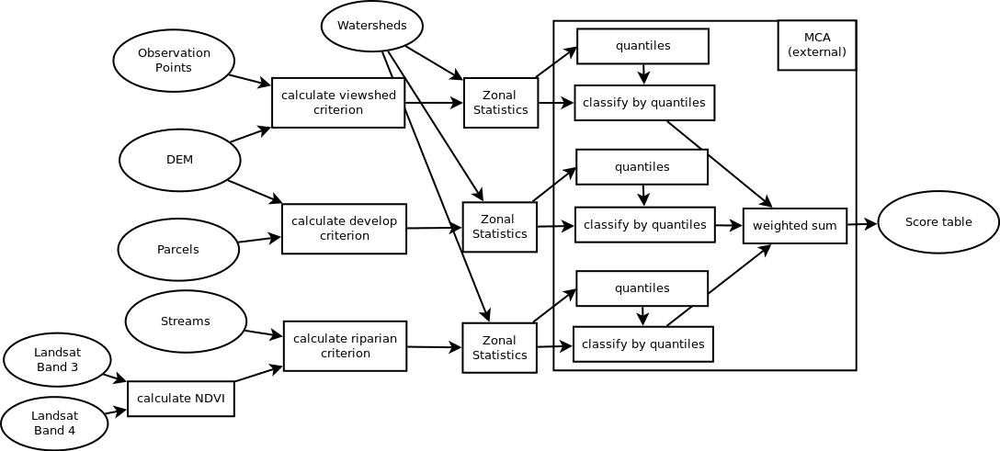

```{r setup, echo = TRUE, message = FALSE, warning = FALSE}
knitr::opts_chunk$set(echo = TRUE, message = FALSE, warning = FALSE)

library(here) ### this points to .Rproj in HW4, not in esm263 repo!
library(tidyverse)
library(terra)
library(sf)
```

# Summary {.tabset}

This script processes the raw data for HW4 to set up data layers for the Multi-Criteria Analysis Shiny app.  Resulting output layers are:

* Zonal stats of viewshed criterion
* Zonal stats of land development criterion
* Zonal stats of riparian criterion

In the Shiny app, users perform a multi-criteria analysis across these criteria by selecting weights for each criterion and selecting a number of quantiles for the input layers.

Note: my version of this analysis may be very different in terms of steps, methods, use of rasters vs polygons for masking, etc. than a similar analysis designed for QGIS or ArcMap.

## Assignment description

From the assignment:

>Your task is to advise a land trust on which watersheds have the best overall conservation potential. The land trust wants to conduct conservation efforts in watersheds that would help preserve both riparian habitat and scenic viewsheds through conservation easement purchases on inexpensive, but developable land. You will use an MCA framework to produce your results.



### Available data

The data for this assignment are in [HW4.zip](https://niklasphabian.github.io/ESM263_GIS/assignment/04/HW4.zip).

They have all been projected into “NAD83 / California Albers” (EPSG:3310). The vector layers have been clipped to our region of interest (roi), which is a collection of watersheds in southern Santa Barbara County.

`r knitr::kable(read_csv(here('raw_data/data_sources.csv')))`

### Assumptions (from assignment)

* *Riparian habitat* is anywhere within 1000 ft of a stream that has an observed Normalized Difference Vegetation Index (NDVI) between 0.2 and 0.5.
* *Viewshed* is anywhere visible from at least one observation point.
* *Developable land* is anywhere with a slope of less than 20 percent.
* *Land cost* is the parcel price per square meter (USD / m²), calculated as `Parcels.NET_AV` (in USD) divided by `Parcels.Shape_Area` (in m²).
* *Public parcels* (parcels with a non-null `Parcels.NONTAXCODE`) should be ignored.
* *Unit of analysis* is 1 hectare (e.g., cell size = 100 m).
* *Standardized scores* are integers from 1 to 4, where 1 = "best" and 4 = "worst".
    * Use quartiles (4 quantiles) to assign the scores.
    * Note: for this implementation, users may choose a different number of quantiles if they so desire, e.g., quintiles.
    * Use the following weights to combine the scores (again, users can select different values if desired):

| weight | score                 |
|:------:|:----------------------|
|  0.50	 | riparian habitat area |
|  0.33	 | viewshed area         |
|  0.17	 | developable land cost |

### Set up base raster (by watershed ID)

Read in county shapefile and 100m resolution DEM; mask DEM with county boundary to create a county mask and base raster.  Read in watersheds and rasterize to base raster.  Save out, and for efficiency, if the raster is already present, do not re-run the rasterization code.  This save-out and if statement process will be used for all intermediate rasters.

```{r ggplot plotting of rasters}
roi_sf <- read_sf(dsn = here('raw_data/input.gpkg'),
                  layer = 'roi')
plot_rast <- function(r) {
  r_df <- as.data.frame(r, xy = TRUE) %>%
    setNames(c('x', 'y', 'z'))
  ggplot() +
    geom_sf(data = roi_sf, color = NA, fill = 'darkred', alpha = .2) +
    geom_raster(data = r_df, aes(x, y, fill = z)) +
    geom_sf(data = roi_sf, color = 'darkred', fill = NA) +
    theme_void() +
    scale_fill_viridis_c()
}
```


```{r watershed id rast}
watershed_rast_file <- here('shiny_data/watershed_id.tif')

if(!file.exists(watershed_rast_file)) {
  dem_rast <- rast(here('raw_data/dem100.tif'))
  # st_layers(here('raw_data/input.gpkg'))
  sb_cty_sf <- read_sf(dsn = here('raw_data/input.gpkg'),
                       layer = 'roi')
  
  sb_ws_sf <- read_sf(dsn = here('raw_data/input.gpkg'),
                      layer = 'watersheds')
  sb_ws_r <- rasterize(sb_ws_sf, dem_rast, field = 'calw221', fun = min)
  
  writeRaster(sb_ws_r, watershed_rast_file, overwrite = TRUE)
} else {
  message('File ', watershed_rast_file, ' exists... skipping!')
}
sb_ws_r <- rast(watershed_rast_file)

plot_rast(sb_ws_r) +
  labs(title = 'Santa Barbara watershed IDs',
       fill = 'Watershed ID')

```


## Calculate Viewshed Criterion

*Viewshed* is anywhere visible from at least one observation point.  As of version 1.7-18, `terra` has a function `terra::viewshed()`.  *Viewshed* is anywhere visible from at least one observation point; assume an observer 1.8 meters tall.  

Currently, the observation points must be a location (x-y) or a cell number.  This is less than ideal, but we can make it work.  Other methods to calculate viewsheds exist (e.g., `windfarmGA` package, or GRASS-based methods) but I'd like to keep the workflow in `terra` as much as possible.

Since (as of March 2023) terra::viewshed can only calculate viewshed for one point at a time, we can loop over all points (e.g., `purrr` functionality) to generate a viewshed raster for each observation point, then add them all up.  Any cell with visibility from at least one point would count as visible.

I implemented this using purrr::map(), turning a matrix with columns of x and y, into a list with each element being a row of the matrix.  But the `as.data.frame() %>% as.list()` flow returns elements of each *column* of the dataframe, so I transposed the matrix first.  It would also be very easy to do a for loop, indexing over rows.

### Calculate per-cell visibility

```{r visible rast}
visible_rast_file <- here('shiny_data/intermediate/visible_rast.tif')

if(!file.exists(visible_rast_file)) {
  dem_rast <- rast(here('raw_data/dem100.tif'))
  
  obs_points_sf <- read_sf(dsn = here('raw_data/input.gpkg'),
                           layer = 'Observation_Points') %>%
    janitor::clean_names()
  obs_points_mtx <- st_coordinates(obs_points_sf)

  loc_list <- obs_points_mtx %>%
    t() %>%
    as.data.frame() %>%
    as.list()
  
  visible_list <- purrr::map(
    .x = loc_list,        ### list of X/Y vector locations
    .f = terra::viewshed, ### the function to apply
    x = dem_rast,         ### in terra::viewshed, x is the DEM raster
    observer = 1.8,       ### assumed observer height
    target = 0            ### assumed target height (ground level)
  )
  
  ### bind list of rasters into a single multi-layer SpatRaster object
  visible_stack <- terra::rast(visible_list)
  
  ### sum all layers in the stack; values are how many "true" values for each
  ### cell, i.e., how many obs sites can see this cell
  visible_sum <- sum(visible_stack)
  
  ### Drop all zero values, so result can act like a mask
  visible_rast <- visible_sum
  visible_rast[visible_rast == 0] <- NA
  
  writeRaster(visible_rast, visible_rast_file)
} else {
  message('File ', visible_rast_file, ' exists... skipping!')
}

visible_rast <- rast(visible_rast_file)

obs_points_sf <- read_sf(dsn = here('raw_data/input.gpkg'),
                         layer = 'Observation_Points') %>%
  janitor::clean_names()

plot_rast(visible_rast) +
  labs(title = 'Visible from 1 or more observation sites',
       fill = '# of obs pts') +
  geom_sf(data = obs_points_sf, shape = 21, 
          color = 'yellow', fill = 'red', size = 2)

```

### Create final zonal statistics layer

For each watershed, I will assume greater total viewshed area (rather than average) is the metric of choice.  Additionally, I will assume that a cell's viewshed value is the same whether visible from one or many points.  These assumptions are not explicit in the assignment, so other assumptions might be equally valid, e.g.:

* a cell's viewshed value increases linearly with number of observation points
* a cell's viewshed value increases with number of observation points but with decreasing marginal value
* a viewshed's value is based on average visibility rather than total visibility

```{r viewshed zonal}
visible_flat <- visible_rast / visible_rast
view_by_ws <- zonal(visible_flat, sb_ws_r, fun = sum, na.rm = TRUE, as.raster = TRUE)
plot_rast(view_by_ws) +
  labs(title = 'Total viewshed value, non-public land in watershed',
       fill = 'Cells in viewshed')

writeRaster(view_by_ws, here('shiny_data', 'viewshed_by_watershed.tif'),
            overwrite = TRUE)
```

## Calculate Develop Criterion

*Developable land* is anywhere with a slope of less than 20 percent.  *Land cost* is the parcel price per square meter (USD / m²), calculated as `Parcels.NET_AV` (in USD) divided by `Parcels.Shape_Area` (in m²).  *Public parcels* (parcels with a non-null `Parcels.NONTAXCODE`) should be ignored.

### Create a "developable" raster

Feed the digital elevation model into `terra::terrain()`.

```{r}
slope_mask_file <- here('shiny_data/intermediate/slope_mask.tif')

if(!file.exists(slope_mask_file)) {
  dem_rast <- rast(here('raw_data/dem100.tif'))
  
  slope_rast <- terra::terrain(dem_rast, v = 'slope', unit = 'degrees')
  
  ### Mask to exclude ocean and non-county; then set high slope values to NA
  slope_mask <- mask(slope_rast, sb_ws_r)
  slope_mask[slope_mask > 20] <- NA
  
  writeRaster(slope_mask, slope_mask_file)
} else {
  message('File ', slope_mask_file, ' exists... skipping!')
}
slope_r <- rast(slope_mask_file)

plot_rast(slope_r) +
  labs(title = 'Developable: slope <= 20 degrees',
       fill = 'Slope (deg)')
```

### Create a land cost raster, ignoring public parcels

```{r land cost layer}
land_cost_file <- here('shiny_data/intermediate/land_cost.tif')

if(!file.exists(land_cost_file)) {
  sb_parcels_sf <- read_sf(dsn = here('raw_data/input.gpkg'),
                           layer = 'parcels') %>%
    janitor::clean_names()
  sb_parcels_nonpublic_sf <- sb_parcels_sf %>%
    filter(is.na(nontaxcode))
  sb_parcel_cost_r <- rasterize(sb_parcels_nonpublic_sf, sb_ws_r, 
                                field = 'net_av', fun = min)
  sb_parcel_area_r <- rasterize(sb_parcels_nonpublic_sf, sb_ws_r, 
                                field = 'shape_area', fun = min)

  sb_cost_area_r <- sb_parcel_cost_r / sb_parcel_area_r
  
  writeRaster(sb_cost_area_r, land_cost_file)
} else {
  message('File ', land_cost_file, ' exists... skipping!')
}
sb_cost_area_r <- rast(land_cost_file)

plot_rast(sb_cost_area_r) +
  labs(title = 'Parcel value per area',
       fill = '$/m^2')
```

### Create final zonal statistics layer

For each watershed, mask cost per m^2^ using the developable land mask.  Summarize total cost of developable land per watershed.

```{r developable slope}
developable_cost_r <- sb_cost_area_r %>% mask(slope_r)

cost_by_ws <- zonal(developable_cost_r, sb_ws_r, fun = sum, na.rm = TRUE, as.raster = TRUE)
plot(cost_by_ws, axes = FALSE, col = hcl.colors(50),
     main = 'Total cost of developable, non-public land in watershed')

writeRaster(cost_by_ws, here('shiny_data', 'cost_by_watershed.tif'),
            overwrite = TRUE)
```


## Calculate Riparian Criterion

*Riparian habitat* is anywhere within 1000 ft of a stream that has an observed Normalized Difference Vegetation Index (NDVI) between 0.2 and 0.5.

### Calculate NDVI layer

Read in the Landsat data, calculate NDVI from bands 3 (red) and 4 (near-infrared) per:

$$NDVI = \frac{NIR - red}{NIR + red} = \frac{band4 - band3}{band4+band3}$$

Note the NDVI data is 30 x 30 m, not 100 x 100 m.  Reproject to 100 x 100m, using bilinear (default) based on the `sb_ws_r` watershed ID raster.

```{r ndvi mask}
ndvi_mask_file <- here('shiny_data/intermediate/ndvi_mask.tif')

if(!file.exists(ndvi_mask_file)) {
  ls_data_30 <- rast(here('raw_data/Landsat71.tif'))
  
  ls_data_100 <- project(ls_data_30, sb_ws_r)
  
  ### ls_data
  nir <- ls_data_100$Landsat71_4; red <- ls_data_100$Landsat71_3
  
  ndvi_raw <- (nir - red) / (nir + red)
  
  plot(ndvi_raw, main = 'NDVI calculated',
       axes = FALSE, col = hcl.colors(20, palette = 'RedGreen'))
  
  ndvi <- ndvi_raw
  ndvi[ndvi > 0.5 | ndvi < 0.2] <- NA ### drop values outside desired range
  ndvi[!is.na(ndvi)] <- 1 ### set all remaining values to 1 for acceptable veg
  
  
  writeRaster(ndvi, ndvi_mask_file, 
              overwrite = TRUE)
} else {
  message('File ', ndvi_mask_file, ' exists... skipping!')
}

ndvi <- rast(ndvi_mask_file)

plot_rast(ndvi) +
  labs(title = 'NDVI mask (NDVI between 0.2 and 0.5)') +
  theme(legend.position = 'none')

```

### Calculate streams layer

Read in stream, buffer to 1000 feet, rasterize to watershed ID raster.

```{r calc streams}
stream_buffer_mask_file <- here('shiny_data/intermediate/stream_buffer.tif')
if(!file.exists(stream_buffer_mask_file)) {
  stream_sf <- read_sf(dsn = here('raw_data/input.gpkg'),
                       layer = 'streams')
  
  stream_buff_sf <- st_buffer(stream_sf, dist = 304.8) ### 304.8 m = 1000 ft
  
  stream_buff_r <- rasterize(stream_buff_sf, sb_ws_r, field = '', fun = min) %>%
    mask(sb_ws_r)
  
  writeRaster(stream_buff_r, stream_buffer_mask_file,
              overwrite = TRUE)
} else {
  message('File ', stream_buffer_mask_file, ' exists... skipping!')
}
  
stream_buff_r <- rast(stream_buffer_mask_file)
plot_rast(stream_buff_r) +
  labs(title = 'Streams with 1000 ft buffer') +
  theme(legend.position = 'none')


```


### Mask NDVI with streams

Mask to find NDVI $\in$ [0.2, 0.5] within 1000 ft of a stream

```{r stream riparian mask}
stream_rip_mask_file <- here('shiny_data/intermediate/ndvi_stream_buffer.tif')
if(!file.exists(stream_rip_mask_file)) {
  rip_ndvi <- ndvi %>%
    mask(stream_buff_r)
  
  writeRaster(rip_ndvi, stream_rip_mask_file,
              overwrite = TRUE)
} else {
  message('File ', stream_rip_mask_file, ' exists... skipping!')
}

rip_ndvi <- rast(stream_rip_mask_file)

plot_rast(rip_ndvi) +
  labs(title = 'Riparian habitat (NDVI [0.2, 0.5] and 304.8m/1000ft of stream)') +
  theme(legend.position = 'none')
```


### Create final zonal statistics layer

For each watershed, sum available riparian habitat.

```{r riparian zonal}
rip_by_ws <- zonal(rip_ndvi, sb_ws_r, fun = sum, na.rm = TRUE, as.raster = TRUE)
plot_rast(rip_by_ws) +
  labs(title = 'Total riparian area per watershed',
       fill = 'Riparian area (ha)')

writeRaster(rip_by_ws, here('shiny_data', 'riparian_by_watershed.tif'),
            overwrite = TRUE)
```

